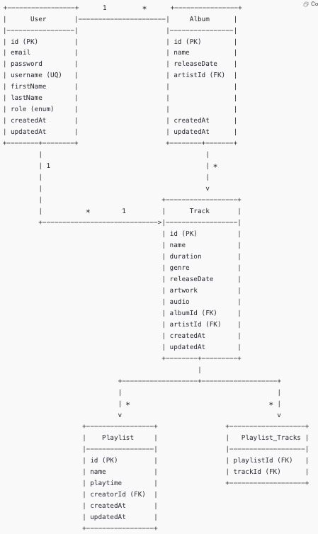

## Feelit Music API – Tracks & Playlists Microservice
***
### Description
- This project is a simple yet powerful microservice API designed to manage music Tracks and Playlists. It supports core operations such as creating, updating, and retrieving tracks and playlists.
The API is built using TypeScript and leverages a modern Node.js framework(NestJS).

### Features
- Create, update, delete, and list Tracks
- Create, update, delete, and list Playlists
- Add/remove tracks to/from playlists
- Retrieve playlist contents with track details
- Create, update, delete, and list Albums
- Retrieve album details including tracks and release information
- Create, update, delete, and list Users (Artists)
- Retrieve artist profiles with associated albums and tracks
***
### Tech Stack
- Node.js
- TypeScript
- NestJS
- PostgreSQL
- Docker

## Project Setup Instructions
***
```bash
$ git clone https://github.com/Mhlengi/feelit.git

$ cd feelit

$ npm install
```
### Environment configuration
- Create a .env file in the root directory and configure the following:
```bash
DB_HOST=127.0.0.1
DB_PORT=5432
DB_USERNAME=******
DB_PASSWORD=******
DB_NAME=******
```
- For the above environment configuration, one needs to create a PostgreSQL database.
```bash
$ psql -U postgres

$ CREATE DATABASE your_database_name;
```

## Compile and run the project

```bash
# development
$ npm run start

# watch mode
$ npm run start:dev

# production mode
$ npm run start:prod
```
***
## Docker support
```bash
$ docker-compose down; docker compose up --build;
````

## Run tests

```bash
# unit tests
$ npm run test

# e2e tests
$ npm run test:e2e

# test coverage
$ npm run test:cov
```
***
### Entity Relationship Diagram (ERD)
<p align="center">
  
</p>

***
### REST CRUD Operations API endpoints
***
- Track Endpoints
  - | Method | Endpoint       | Description          |
    | ------ | -------------- | -------------------- |
    | POST   | `/tracks`      | Create a new track   |
    | GET    | `/tracks`      | Get all tracks       |
    | GET    | `/tracks/{id}` | Get a track by ID    |
    | PUT    | `/tracks/{id}` | Update a track by ID |
    | DELETE | `/tracks/{id}` | Delete a track by ID |

***
- Playlist Endpoints
  - | Method | Endpoint          | Description             |
    | ------ | ----------------- | ----------------------- |
    | POST   | `/playlists`      | Create a new playlist   |
    | GET    | `/playlists`      | Get all playlists       |
    | GET    | `/playlists/{id}` | Get a playlist by ID    |
    | PUT    | `/playlists/{id}` | Update a playlist by ID |
    | DELETE | `/playlists/{id}` | Delete a playlist by ID |
***
- Album Endpoints
  - | Method | Endpoint       | Description           |
    | ------ | -------------- | --------------------- |
    | POST   | `/albums`      | Create a new album    |
    | GET    | `/albums`      | Get all albums        |
    | GET    | `/albums/{id}` | Get an album by ID    |
    | PUT    | `/albums/{id}` | Update an album by ID |
    | DELETE | `/albums/{id}` | Delete an album by ID |

***
- User(Artist) Endpoints 
  - | Method | Endpoint      | Description         |
    | ------ | ------------- | ------------------- |
    | POST   | `/users`      | Create a new user   |
    | GET    | `/users`      | Get all users       |
    | GET    | `/users/{id}` | Get a user by ID    |
    | PUT    | `/users/{id}` | Update a user by ID |
    | DELETE | `/users/{id}` | Delete a user by ID |

***
### Data populated via Postman collections
- [Download the collection](feelit_music_api_tracks_and_playlists_microservice.json) and import it into your Postman app.
- `{{base_url}}` — replace with your API base URL.
